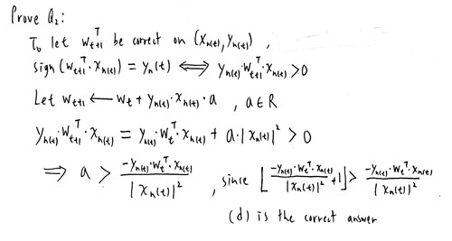
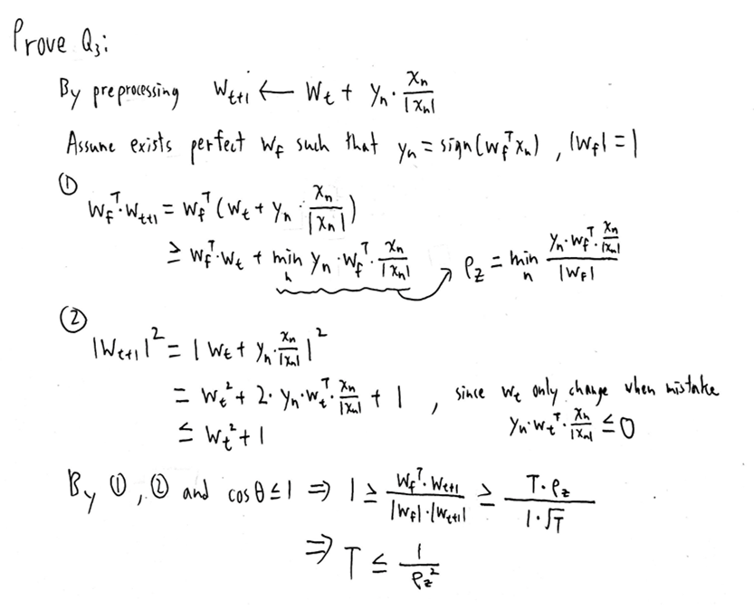
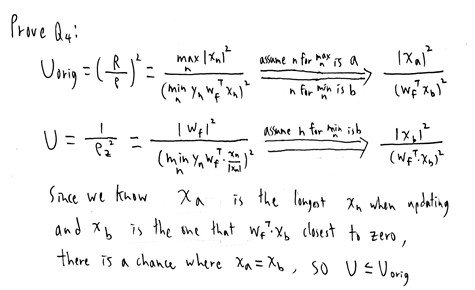
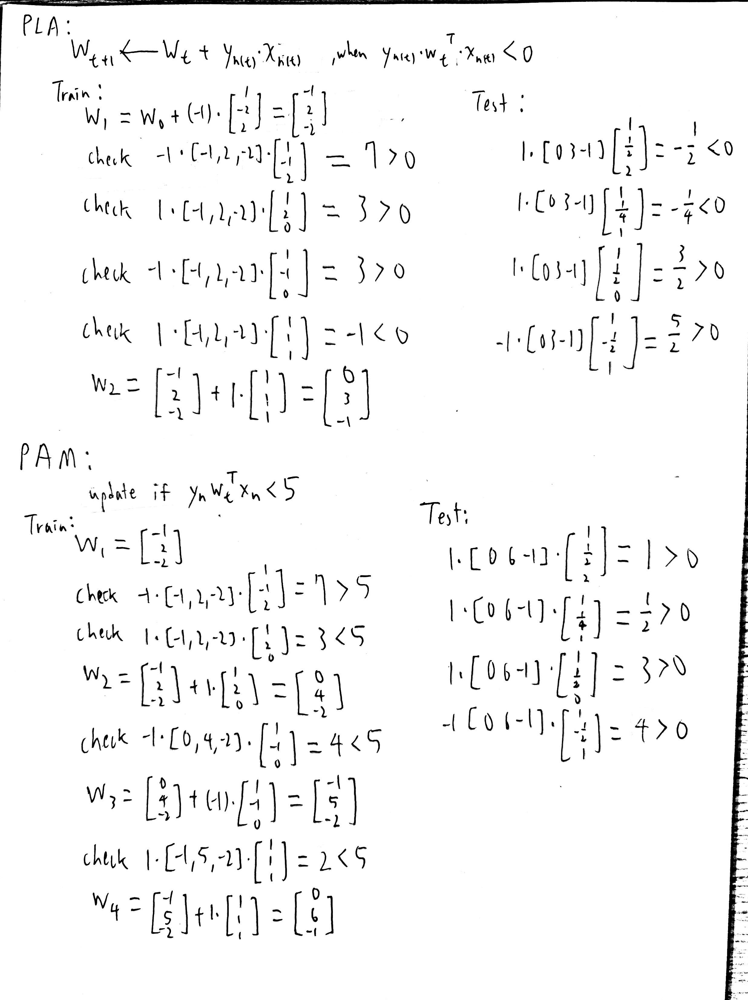
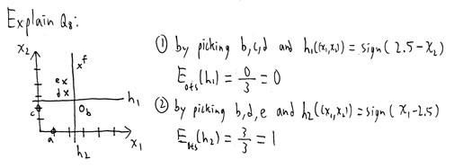
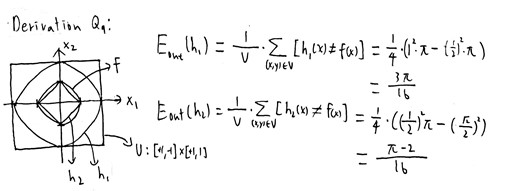
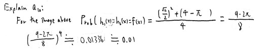
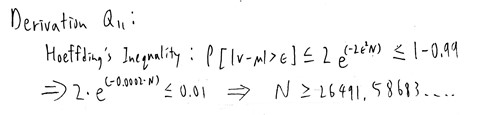
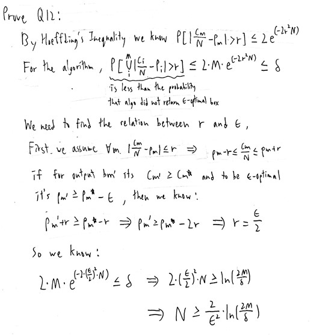

# Homework 1
1. (a) <br>
   Explain: Tasks that's suited for machine learning have the following feature.<br>
   1. Some underlying pattern to be learned ------ (b) doesn't have underlying pattern to be learned
   2. no programmable (easy) definition ------ (c) have programmable definition
   3. there is data about the pattern ------ (d) doesn't have the data about Zeus actual image
   
    (a) have all three feature so it's best suited for machine learning.
2. (d)<br>
   <br>
3. (c)<br>
   <br>
4. (b)<br>
   <br>
5. (c)<br>
   <br>
6. (a)<br>
   Explain: Because recommender problem needs to learn from real number rating which is a continuous value by some known rating data, so supervised regression best describes the associated learning problem.
7. (b)<br>
   Explain: Because the labeler splits the outputs into two classes, the machine learns to categorizes new observations into one of two classes, so binary classification best describes the associated learning problem.
8. (e)<br>
   <br>
9. (d)<br>
    <br>
10. (b)<br>
    <br>
11. (a)<br>
    <br>
12. (d)<br>
    <br>
13. (b)
14. (a)
15. (d)
16. (e)
17. (d)
18. (d)
19. (e)
20. (c)
<br>
<br>
```Python
import numpy as np
import random

filename = 'data.txt'

x_vector_array = np.ones([256, 11])
x0 = 1      #set to different number according to the problem
y_array = np.zeros(256)
with open(filename) as file:
    a = 0
    for line in file:
        line = line.strip().split()
        for i in range(10):
            x_vector_array[a][i+1] = line[i]
        x_vector_array[a][0] = x0
        y_array[a] = line[10]
        a += 1
file.close()

#x_vector_array = x_vector_array / 2    #for scaling if needed

N = 256
M = N * 4       #set to different number according to the problem
total_E = 0
update_num_array = np.zeros(1000)
w0_array = np.zeros(1000)
for i in range(1000):
    correct_times = 0
    w_vector = np.zeros(11)
    update_num = 0
    while correct_times < M:
        r_seed = random.randint(0, 255)
        sign_for_wTx = np.sign(np.dot(w_vector, x_vector_array[r_seed]))
        if (sign_for_wTx != -1 and y_array[r_seed] == 1) or (sign_for_wTx == -1 and y_array[r_seed] == -1):
            correct_times += 1
            continue
        else:
            correct_times = 0
            w_vector = w_vector + y_array[r_seed] * x_vector_array[r_seed]
            update_num += 1
    update_num_array[i] = update_num
    w0_array[i] = w_vector[0] * x0      #set to different number according to the problem
    wrong_sign = 0
    for j in range(256):
        sign_for_wTx = np.sign(np.dot(w_vector, x_vector_array[j]))
        if (sign_for_wTx == -1 and y_array[j] == 1) or (sign_for_wTx != -1 and y_array[j] == -1):
            wrong_sign += 1
    total_E += wrong_sign / 256
average_E = total_E / 1000

print(average_E)
print(np.median(update_num_array))
print(np.median(w0_array))
```